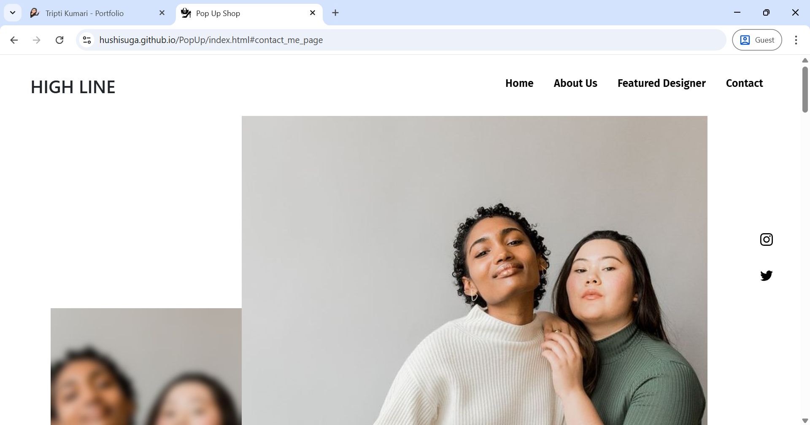
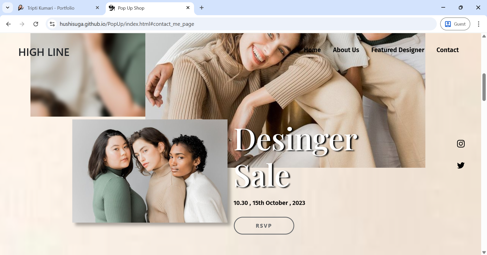
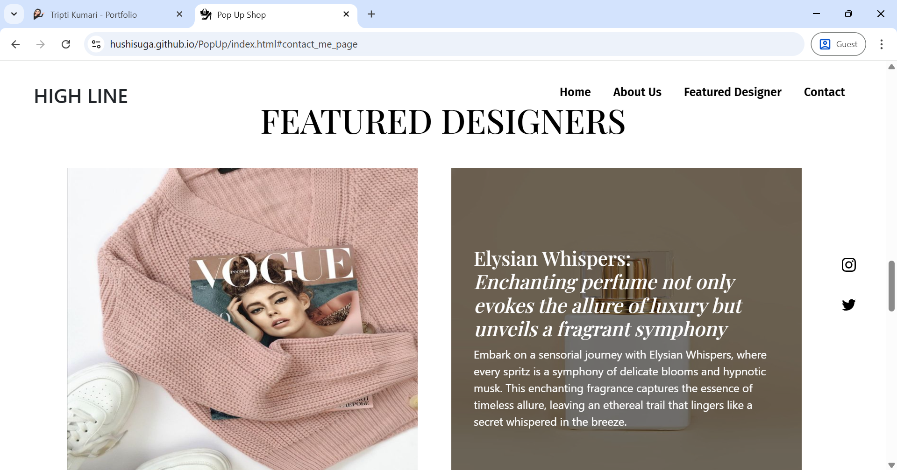
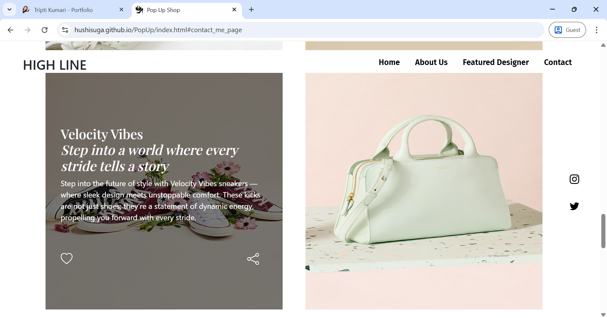

# PopUP | HIGHLINE Fashion E-Commerce Website

PopUP (by HIGHLINE) is a front-end luxury fashion e-commerce website built using **HTML** and **CSS**, designed to showcase high-end products in a visually elegant and responsive format. This project is aimed at simulating a premium shopping experience with a minimalistic, modern UI.


## 🌐 Project Overview

- **Type:** Front-End Project (Static Website)
- **Tech Stack:** HTML5, CSS3 (No JavaScript)
- **Company Name:** HIGHLINE
- **Concept:** Luxury Fashion E-Commerce Platform
- **Status:** Complete (UI & Responsive Design)


## ✨ Features

- Responsive design for mobile and desktop views.
- Product showcase with elegant cards (perfume, pink sweater, etc.).
- Luxury-themed branding and layout.
- Hover effects and clean typography for a modern feel.
- Simple yet high-end aesthetic — built to feel like a premium online store.


## 📸 Screenshots

 <br>
 <br>
 <br>
 <br>


## 📽️ Demo Video

> *(Upload your demo video to the repo or use a YouTube link)*

Example:

[▶️ Watch Demo](https://drive.google.com/file/d/19MFhPDBKPojxeKOQNhXNjCtVPd2bQSZl/view?usp=sharing)


## 📱 Responsive Design

This site adapts to different screen sizes:
- Desktop layout with wide product displays
- Mobile-friendly interface with stacked items and touch-friendly navigation


## 🚀 Getting Started

To run this project locally:

```bash
1. Clone the repository:
   git clone https://github.com/your-username/PopUP-Highline.git

2. Open the index.html file in any modern browser.

